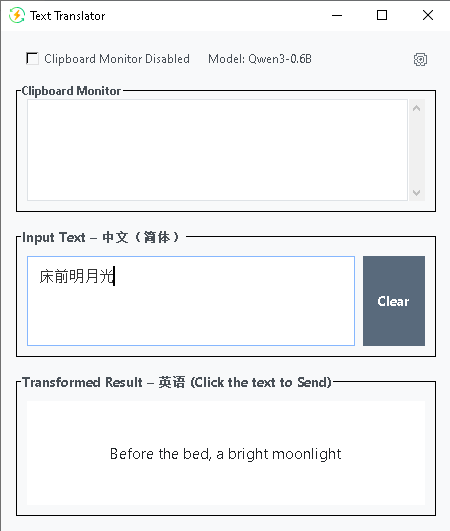
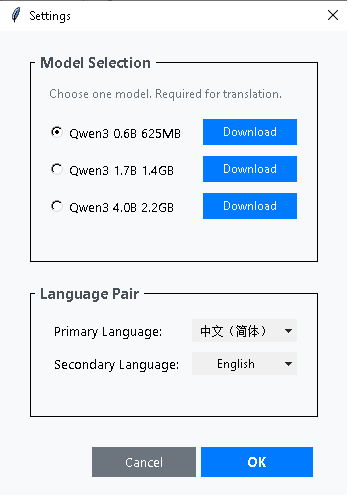

# 🌍 Instant Multilingual Translation with `inputrouter`  
# 🌐 inputrouter — 即时多语言互译工具

> 📝 实时输入翻译 | 🖱️ 一键插入应用 | 🌐 离线运行 | 💾 无需 GPU

---

## 📖 Introduction / 简介

| English | 中文 |
|--------|------|
| Type in one language and instantly see the translation in another — for example, type in Chinese and get real-time English output, or type in English to generate Chinese. Click the translated text to insert it directly into target applications such as Word, chat apps, email clients, etc. | 输入一种语言，实时转换为另一种语言 —— 例如，中文输入即时转英文，英文输入即时转中文。点击翻译结果，可直接插入到 Word、聊天软件、邮件等目标应用中。 |
| Supports direct mutual translation among **20+ languages**. Also enables **clipboard translation**: simply copy text, and the translated version appears immediately. | 支持 **20 多种语言**之间的直接互译。支持**剪贴板翻译**：复制需要翻译的文本，翻译结果立即显示。 |
| Built-in **local LLM models** run entirely on CPU — no GPU required. Once downloaded, the model works **fully offline** without internet access. | 内置**本地大语言模型**，纯 CPU 运行，无需显卡。模型下载后可**完全离线使用**，无需联网。 |

---

## 🌐 Supported Languages / 支持语言

**Auto-detects and translates between the following 23 languages:**

**English / 英文:**
```
"Chinese (Simplified)", "Chinese (Traditional)", "English", "French", "Spanish",
"Portuguese", "Russian", "Arabic", "Japanese", "Korean", "German", "Italian",
"Dutch", "Vietnamese", "Indonesian", "Malay", "Thai", "Hindi", "Urdu",
"Turkish", "Swedish", "Danish", "Norwegian"
```

**中文 / 中文:**
```
"中文（简体）", "中文（繁体）", "英语", "法语", "西班牙语", "葡萄牙语",
"俄语", "阿拉伯语", "日语", "韩语", "德语", "意大利语", "荷兰语", "越南语",
"印尼语", "马来语", "泰语", "印地语", "乌尔都语", "土耳其语", "瑞典语",
"丹麦语", "挪威语"
```

---

## ⚙️ Installation Instructions / 安装方法

| English | 中文 |
|--------|------|
| 1. Download the package.<br>2. Extract the archive.<br>3. Run the `.exe` file directly — no installation required. | 1. 下载程序包。<br>2. 解压文件。<br>3. 直接运行 `.exe` 文件，无需安装。 |

> ✅ **Portable & Lightweight** — No admin rights or registry changes needed.  
> ✅ **便携轻量** — 无需管理员权限，不修改注册表。

---

## 📦 Download Packages / 下载包

- `inputrouter.zip.001`
- `inputrouter.zip.002`

> 🔧 **Note**: This is a split archive. Use 7-Zip or WinRAR to extract both parts together.

| English | 中文 |
|--------|------|
| - Program-only archive (models not included).<br>- On first run, models are downloaded automatically (requires access to Hugging Face).<br>- Currently available for **Windows only**. | - 仅包含程序的压缩包（不含模型）。<br>- 首次运行时自动下载模型（需可访问 Hugging Face）。<br>- 目前仅支持 **Windows 平台**。 |

---

## 🤖 Currently Available Models / 目前可选模型

| Model | Size | Performance |
|------|------|-------------|
| `Qwen3 0.6B` | ~600M parameters | Fast on low-end CPUs |
| `Qwen3 1.7B` | ~1.7B parameters | Higher accuracy, moderate speed |

> 💡 The app will prompt you to select a model on first launch.  
> 💡 首次运行时，程序将提示选择模型。

---

## 🛑 If You Cannot Connect to huggingface.co / 如果无法连接 huggingface.co

| English | 中文 |
|--------|------|
| If automatic model download fails due to network restrictions: | 若因网络限制无法自动下载模型： |
| 1. Manually download the following files:<br>   - [`Qwen3-0.6B-Q8_0.gguf`](https://huggingface.co/Qwen/Qwen3-0.6B-GGUF/)<br>   - [`Qwen3-1.7B-Q6_K.gguf`](https://huggingface.co/Qwen/Qwen3-1.7B-GGUF/)<br>2. Ensure filenames match **exactly** as listed.<br>3. Place them in the **same directory** as `inputrouter.exe`. | 1. 手动下载以下文件：<br>   - `Qwen3-0.6B-Q8_0.gguf`<br>   - `Qwen3-1.7B-Q6_K.gguf`<br>2. 确保文件名**完全一致**。<br>3. 将文件放入 `inputrouter.exe` 所在的**同一目录**。 |

---

## 📸 Screenshots / 截图

### 🖼️ Main Interface / 主界面


> Real-time input and translation preview with click-to-insert functionality.  
> 实时输入与翻译预览，点击即可插入目标应用。

### ⚙️ Settings Panel / 设置界面


> Choose translation direction, model, and clipboard behavior.  
> 可设置翻译方向、模型选择与剪贴板行为。

---

## 📞 Feedback & Support / 反馈与支持

Have questions or suggestions? Reach out via GitHub or email!  
如有问题或建议，欢迎通过 GitHub 或邮件联系！

> ✉️ contact@example.com | 🌐 github.com/your-repo/inputrouter

---

✅ **Lightweight • Offline • No Ads • No Data Collection**  
✅ **轻量 • 离线 • 无广告 • 不收集用户数据**

---

