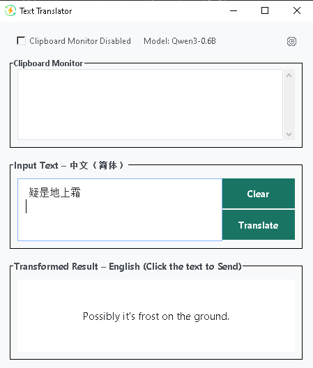

# inputrouter即时多语言互译
## 简介
中文打字直接变成英文，英文打字直接变成中文，翻译后的内容点击即可直接插入目标应用比如Word，chat...。支持二十多种语言直接互换。支持剪切板内容直接翻译：复制需要翻译的内容，直接显示翻译后的内容。内置本地模型，CPU运行无须显卡，下载模型后无须联网。
## 支持语言
"中文（简体）", "中文（繁体）", "英语", "法语", "西班牙语", "葡萄牙语", "俄语", "阿拉伯语", "日语", "韩语", "德语", "意大利语", "荷兰语", "越南语", "印尼语", "马来语", "泰语", "印地语", "乌尔都语", "土耳其语", "瑞典语", "丹麦语", "挪威语"
## 安装方法
直接下载解压运行.exe文件
## 下载包
- 不包括模型下载包，运行后自动下载模型（需要能够连Huggingface）
- release_a_270925.zip.001
- release_a_270925.zip.002
- 目前仅Windows平台
## 目前可选模型
- Qwen3 0.6B模型
- Qwen3 1.7B模型
## 图片

